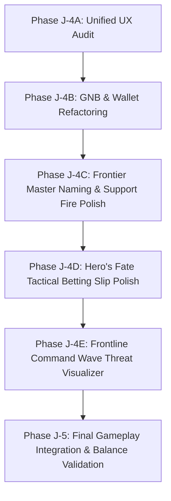

# Dark Frontier Unified UX Audit: 자본전선: 데드라인 (Capital Front: Deadline)

**Document Type:** Unified UX Pass & Consistency Audit  
**Phase Identifier:** Phase J-4A  
**Benchmark Reference:** Smith & Shards (전쟁 대장간) Sandbox UI  
**Target Modules:** Frontier Master (프론티어 마스터), Hero's Fate (히어로즈 페이트), Frontline Command (전선 지휘부)

---

## 1. Product-Wide UX Verdict

The introduction of the high-fidelity **Smith & Shards (전쟁 대장간)** sandbox mockup has established a new aesthetic, tactile, and narrative benchmark for *자본전선: 데드라인*. The dark, militarized command-room look, the dramatic visual feedback of anvil strikes, the red-striped sovereign hazard warnings, and the cascading circular recoveries make the system feel tactile, high-stakes, and deeply immersive.

However, when transitioning between modules, the contrast is stark. The product currently exhibits a **"split-personality" UX flaw**:
- **Smith & Shards** feels like a high-budget tactical military interface.
- **Frontier Master** still exposes residual traces of a generic casual clicker ("Convenience Store", "Pizza Franchise" in English, and raw spreadsheet button-spamming).
- **Hero's Fate** is presented as an abstract, text-heavy financial bet slip that obscures the dark fantasy of wagering on the lives of frontline squads.
- **Frontline Command** is highly quantitative, text-dense, and lacks immediate visual cues to convey tactical defense layouts or the sheer physical pressure of oncoming monster waves.

### Core Audit Verdict
> [!IMPORTANT]
> The four modules currently feel like **four separate applications stitched together** rather than a unified war-capital simulator. To elevate *자본전선: 데드라인* to a state-of-the-art premium title, we must unify all interactions under a single cohesive, high-stakes command-room identity: **"You are the Rearline War-Capital Commander funding a desperate frontline survival struggle."**

---

## 2. Frontier Master (프론티어 마스터) Audit

### Current Problems & Disconnections
- **Tone Clash**: In English translations, properties like "Hotdog Stand," "Pizza Franchise," and "Convenience Store" completely break the wartime immersion. While the Korean copy uses "임시 보급소" (Temporary Supply Post) and "야전 보급 본부" (Field Supply Headquarters), the visual presentation is still a standard vertical list of buttons with flat cash costs.
- **Clicker Monotony**: The giant "TAP!" button lacks a narrative anchor. It feels like clicking a blank developer canvas rather than firing tactical support strikes or triggering rearline resource extractions.
- **Lack of Territory Fantasy**: The progression feels like scaling up abstract numbers rather than physically reclaiming lost military sectors or squeezing taxes out of a desperate war economy.

### Key UX Audits & Gaps
- **Psychological Reward Loop**: Clicking provides flat numeric floaters. There is no sensory buildup or physical impact sound (like the clanging anvil of Smith & Shards).
- **First-Time Player Clarity**: A first-time player sees a blank screen with a large "TAP!" text and a list of grayed-out items. The connection between this tab and the actual defense squad is completely unexplained.

### Tactical Recommendations
1. **Pivot the Clicker Fantasy**: Reframe the "TAP!" button as a **"Tactical Fire-Support Trigger" (전선 화력 지원)** or **"Capital Extraction Pump" (자본 강제 징수)**. Add visual grids showing sector stability.
2. **Standardize Property Terminology**: Fully unify English property names under military supply structures (e.g., Hotdog Stand -> Sector Depot, Pizza Franchise -> Tactical Comm Relay) so they align with the Korean wartime forge terminology.
3. **Add Map/Zone Visual Cues**: Transition from flat listing slots to grouped tactical cards labeled by **수복 구역 (Reclaimed Zones)** with distinct security threat levels.

---

## 3. Hero's Fate (히어로즈 페이트) Audit

### Current Problems & Disconnections
- **"Spreadsheet" Aesthetic**: The tab feels like a stock trading broker panel rather than an underground, high-stakes military betting room.
- **Abstract Stakes**: The UI uses options like "Blue Chip Stock" and "Meme Coin" internally, which are mapped in Korean to "전술적 예측" (Tactical Prediction) and "생존 계약" (Survival Contract). However, the interface displays charts that look like casual stock grids, diluting the dark COMMAND-ROOM fantasy of gambling on human survival.
- **Unclear Risk Presentation**: The severe warning of squad wipes and full capital loss is buried in small text blocks, preventing players from feeling the psychological dread of a high-risk bet.

### Key UX Audits & Gaps
- **Pacing & Reveal Gaps**: Settle transactions occur instantly or via a flat confirmation modal. The emotional tension of watching a combat wave resolve is bypassed by instant dry-run simulations.
- **Onboarding Bottlenecks**: First-time players do not understand the relationship between "Squad DPS," "Stage Wave Signals," and "Contract Risk Tiers." They often place max bets blindly and suffer sudden game overs without understanding the math behind the failure.

### Tactical Recommendations
1. **Reframe Stocks as Military Relics/Operations**: Rebrand the underlying assets as **frontline defense contracts** (e.g., Vanguard Defense Fund -> *선봉대 사수 작전*, Rising Squad Futures -> *기동 종대 돌파 작전*, Underground Raid Bond -> *비인가 돌격 채권*).
2. **Dark Command-Room Atmosphere**: Apply a high-contrast dark overlay to the Betting Slip. Use amber warning labels and radar sweeps to evaluate tactical signal strength.
3. **Dramatize Result Revelations**: When a real contract is settled, replace the instant resolution with a simulated tactical readout showing **"전술 통신 복구 중..." (Restoring Tactical Comms...)** followed by a dramatic survival/casualty stamp.

---

## 4. Frontline Command (전선 지휘부) Audit

### Current Problems & Disconnections
- **Lack of Battlefield Visuals**: The combat is represented by quantitative DPS listings, text logs, and a standard progression bar. The player cannot "see" the threat or visually appreciate their characters' tactical deployment.
- **Text-Heavy Cognitive Load**: The character list is a dense grid of cards that requires deep scrolling and manual inspection of level, stars, equipped weapons, and synergy ratios.
- **Weak Wave Threat Visibility**: The progression of waves (Normal Stage 1-100 and Infinite Mode) feels abstract. The arrival of the **Reaper (사신)** is signaled by status text rather than a terrifying screen-shaking alert.

### Key UX Audits & Gaps
- **Tactical Hierarchy Gaps**: The visual hierarchy does not clearly distinguish between **Summoning (보급 소환)**, **Upgrading (전투 훈련)**, and **Deploying (전투 배치)**. 
- **Preferred Weapon Synergies**: The preferred weapon synergy bonus is informational and easily overlooked because it lacks the bright visual pairing borders used in modern premium games.

### Tactical Recommendations
1. **Wave Threat Gauge**: Implement a dramatic, militarized wave progress indicator at the top. The arrival of Bosses or the Reaper should trigger a flickering red **"🚨 사신 침투 감지" (Reaper Intrusion Detected)** alert state.
2. **Visual Battle Formation Grid**: Replace the text-based squad list with a tactical formation map showing character slots, active ranges, and clear links to their equipped weapons.
3. **Preferred Synergy Highlighting**: When a character is equipped with their preferred weapon type, render a glowing link between the character portrait and the weapon item card, showing a clear green **"⚡ SYNERGY ALIGNED"** indicator.

---

## 5. Cross-Module Consistency Audit

| UX Element | Current State | Target Standard (Benchmark) | Action Required |
| :--- | :--- | :--- | :--- |
| **Typography** | Mixed sizes, regular sans-serif defaults, standard weight. | High-contrast, bold, monospaced numbers, block militarized headers. | Apply `font-mono` to cash, shards, and DPS values. |
| **Button Hierarchy** | Flat emerald colors, default gray disabled fields. | Beveled frames, dynamic hover scales, warning borders for high-risk actions. | Unify hover transition speeds and button bevel styles. |
| **Warning Systems** | Standard `window.confirm` alerts or basic flat red text. | Red-striped danger containers, blinking warning lights, double-action confirmations. | Replace default confirm dialogs with tactical modal containers. |
| **Color Language** | Standard Tailwind greens, blues, and grays. | Sleek dark modes, high-contrast neon accents (amber, crimson, mint). | Purge bright "happy" greens; use deep emerald (`bg-emerald-950`) and dark slate. |
| **Danger Presentation** | Small font-bold alerts. | Striking red hazard banners with hazard diagonal lines (`bg-striped-red`). | Inject tactile danger borders around betting slots and anvil triggers. |

---

## 6. Mobile UX & Thumb Zones Audit

### Mobile Layout Challenges
- **Thumb Reach Zones**: The core game navigation tabs are located at the top of the interface. On modern tall smartphones, reaching the top GNB to switch between "Frontier Master" and "Smith & Shards" creates significant thumb strain.
- **Densely Packed Sliders**: The Black Market slider and the stake adjustment buttons are small and located close to other interactive text buttons, causing high risk of accidental taps (fat-finger syndrome).
- **Viewport Scroll Fighting**: When scrolling through properties or character lists, the tall top header (`사령부 월렛` + GNB) occupies more than 40% of the viewport on standard devices, leaving a tiny scrollable window that feels claustrophobic.

### Tactical Recommendations
1. **Floating Bottom Navigation Bar**: Move the four primary tabs (마스터, 페이트, 대장간, 지휘부) to a floating tactical bottom deck for optimal single-thumb navigation.
2. **Enlarge Active Tap Areas**: Increase the vertical tap height of upgrades and properties to at least 48px to meet standard mobile accessibility guidelines.
3. **Sticky Consolidated Wallet**: Collapse the complex 4-column top wallet header into a compact sticky strip that dynamically shrinks as the player scrolls down.

---

## 7. First-Time Player Clarity Verdict

### Primary Onboarding Bottlenecks
1. **Shared Wallet Confusion**: A first-time player does not realize that **CASH** is a single shared pool spent by both the clicker upgrades, the gacha summons, and the blacksmith forge. Spending all money in the gacha instantly freezes clicker progression.
2. **Betting Settlement Penalty**: The game-over penalty of a failed Hero's Fate bet slip is incredibly harsh (full run collapse). A new player who doesn't understand the tactical signals will lose their entire progress within the first 5 minutes without warning.
3. **Weapon Equipping Loop**: Pulling a weapon from Gacha does not auto-equip it. The player must navigate to "전쟁 대장간," open the "무기 보관고," and manually click "장착" (Deploy), which is highly unintuitive for first-time players.

### Proposed Solutions
- **Visual Capital Allocation Warning**: Display a small warning badge when shared CASH falls below critical thresholds (e.g. less than 1,000 KRW).
- **Safe Zone Onboarding**: Keep the Hero's Fate real betting locked and allow **ONLY** Dry-Run (모의 분석) simulations until Stage 20 is cleared, introducing risk step-by-step.
- **Auto-Equip Prompt**: When a player draws an Epic+ weapon and has an empty character slot, trigger an immediate tactical notification: **"신규 획득 화기 배치 가능. 장착하시겠습니까?"**

---

## 8. Recommended Next Steps

1. **GNB & Tab Labels Cleanup (Safe Visual Polish)**: Standardize primary navigation labels to emphasize the militarized command room identity.
2. **English Translation Terminology Alignment**: Purge casual stock/business terms in English and map them directly to the Korean front-line command equivalents.
3. **Execute Phase J-4B (GNB Polish)**: Implement a unified dark theme and sleek, high-contrast HUD styling without modifying any gameplay formulas or state schemas.
