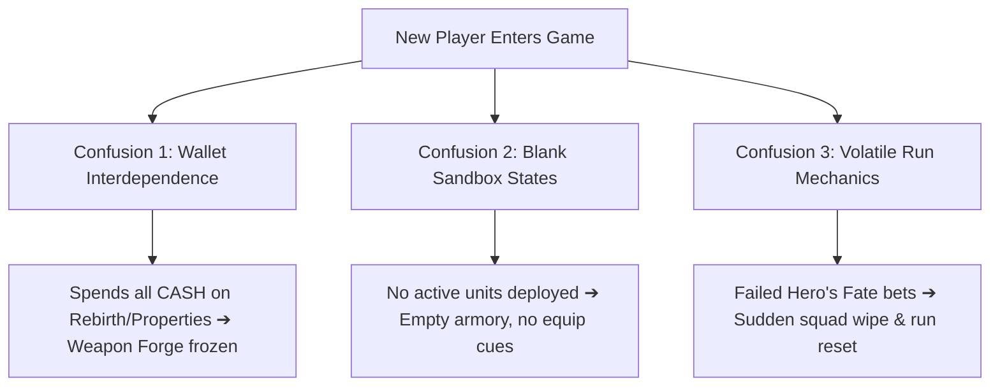

# First-Time Player UX Rework: 자본전선: 데드라인 (Capital Front: Deadline)

**Document Type:** First-Time Player Experience & Onboarding Audit  
**Phase Identifier:** Phase J-4B  
**Target Window:** First 3 Minutes of Gameplay  
**Objective:** Instantly answer what a new player should do, what to click, why they should care, and what threats they face.

---

## 1. Onboarding Confusion Maps

New players landing in *자본전선: 데드라인* for the first time face high cognitive friction. While the UI copy is atmospheric, the lack of explicit directional cues creates three major confusion bottlenecks:



### Bottleneck A: The Shared Wallet Illusion
- **Description:** CASH is a shared global resource across properties, gacha stat upgrades, and blacksmith forge strikes.
- **Cognitive Failure:** Players spend all their initial cash on clicker upgrades and find themselves completely locked out of weapons smithing, without understanding why the economy froze.

### Bottleneck B: The Empty Frontline Command Tab
- **Description:** When the player first enters the RPG tab (Frontline Command), the squad formation is completely blank.
- **Cognitive Failure:** The game displays "총 팀 DPS: 0" and "장착 무기 없음" with no clear instruction that they must first deploy units via a Combat Run.

### Bottleneck C: High-Stakes Betting Lethality
- **Description:** Hero's Fate betting is a high-risk system with full-loss outcomes that wipe the run.
- **Cognitive Failure:** Players place max bets without understanding Tactical Signals, leading to sudden game overs in under two minutes, causing high frustration.

---

## 2. First-Click Clarity Analysis

We mapped the ideal first clicks versus the common erroneous clicks that first-time players execute:

| Module | Ideal First Click | Erroneous First Click | Onboarding Friction |
| :--- | :--- | :--- | :--- |
| **Frontier Master** | `TAP!` (Fire Support) to generate cash ➔ Buy Tier 1 supply. | Buy click upgrades immediately, draining all starter capital. | Button hierarchies look identical; players can't distinguish between high-ROI assets and stat upgrades. |
| **Hero's Fate** | Select low-risk Vanguard contract to preview. | Place max bet on meme contract without checking tactical analysis. | Empty state panel is text-heavy; doesn't guide the user's eye to active contract listings. |
| **Frontline Command** | `START DEFENSE RUN` (전선 방어 작전 개시) to deploy units. | Upgrade combat stats (ATK/SPD) while team size is still zero. | Upgrades are placed at the bottom; top grid remains static, leading players to assume combat is inactive. |

---

## 3. Onboarding Risks & Threats

1. **Information Overload:** Each tab exposes 10+ numbers, 4 currencies, and 3 progress bars concurrently. Without structured vertical layout guides, players suffer analysis paralysis.
2. **Invisible Synergies:** The fact that owning multiple characters of a faction yields huge bonuses is completely hidden in a sub-grid of the Smith & Shards tab.
3. **Sandbox Disconnection:** Players spend time in the Smith & Shards interactive sandbox, thinking it affects combat stats, not realizing it's a test environment.

---

## 4. Emotional Pacing & Reward Design

A successful onboarding loop must generate rapid emotional peaks and a sense of progression within the first 180 seconds:

```
[00:00 - 00:30] 후방 자원 확보 (CASH) ➔ Clicking gives tactile feedback.
[00:30 - 01:20] 전선 수복 작전 (RUN) ➔ Deploying units starts automated combat.
[01:20 - 02:00] 전투 배당금 수급 (DIV) ➔ Kills yield DIV to fund military upgrades.
[02:00 - 03:00] 전쟁 대장간 개방 (Gacha) ➔ Draw first epic weapon & align synergies.
```

To maintain high emotional high-tension:
- Clicking must feel like **militarized contribution** (firing artillery).
- Deploying must feel like **frontline coordination** (placing pieces on a war map).
- Betting must feel like **calculated tactical gambling** (inspecting military signals).

---

## 5. Module Readability & Onboarding Rework

To resolve these issues without modifying live save systems or gameplay formulas, we are introducing **Rearline Tactical Commander Guides** directly under the headers of all three modules. These cards explicitly define:
1. **WHAT THIS MODULE IS** (Role)
2. **WHAT I SHOULD CLICK** (Primary CTA)
3. **WHY I SHOULD CARE** (Rewards)
4. **WHAT THREATS EXIST** (Risks)
5. **LONG-TERM GOALS** (Endgame targets)

### A. Frontier Master (후방 자본 지휘)
- **Problem:** Looked like a generic business clicker vertical list.
- **Rework:** Replaced generic new player hints with a high-contrast militarized Slate block. Reframed primary actions as **Front Fire Support (전선 화력 지원)** and **Supply Sector Depots**.

### B. Hero's Fate (지하 전선 생존 예측)
- **Problem:** spreadsheet stock broker aesthetic causing cognitive freeze.
- **Rework:** Injected an amber-dashed Black-Market Betting slip guide. Prominently explains that failing predictions will result in **squad wipes and full fund loss**, pushing players to calculate risks first.

### C. Frontline Command (최전선 지휘부)
- **Problem:** Blank grids and unguided stat upgrades.
- **Rework:** Injected a teal-bordered Tactical Defense Command guide right above the auto-combat controls. Clearly instructs players to click **[START DEFENSE RUN]** to summon units and spend battle dividends (DIV) on active combat training.

---

## 6. Recommended Player Flow Fixes

1. **Tactical Quick-Start Guides:** Implement cohesive, dark-styled HUD containers highlighting the 5 key dimensions of gameplay.
2. **Translation Realignment:** Purge residual English casual terms ("Hotdog Stand", "Convenience Store") and align them strictly under military terminology ("Temporary Supply Depot", "Forward Outpost") to maintain thematic consistency.
3. **Visual GNB Indicators:** Guide tab switching by pairing them with military icons (🏢, 📈, ⚒️, 🌲).
