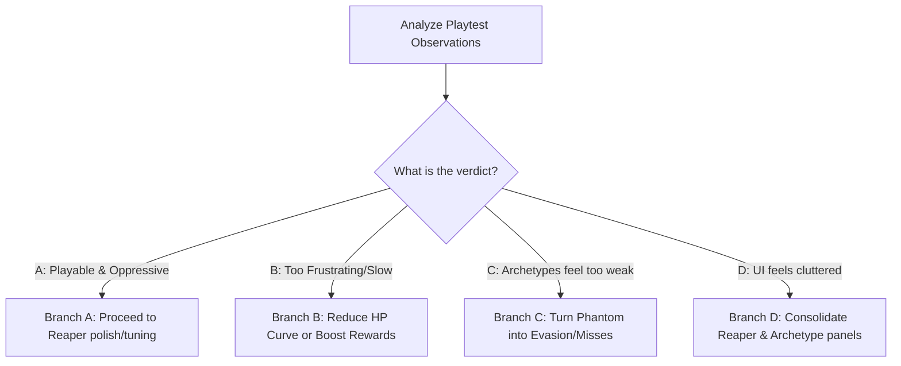

# 🧪 Infinite Mode Playability QA Plan & Manual Test Checklist

This document provides a manual playability QA plan and verification checklist for the current Stage 101+ **Infinite Mode & Reaper** mechanics. It is designed to help playtesters assess whether the current difficulty curves, stat pressure, and economic feedback loops feel engaging, dangerous, and readable before implementing further bespoke features.

---

## 🎯 Playability QA Goal
Evaluate the live gameplay experience of Infinite Mode and the Reaper loop. We need to determine if:
1. The transition from the **Normal Arc** (Stages 1–100) to **Infinite Mode** (Stage 101+) feels seamless and clearly messaged.
2. The specialized **Monster Archetypes** and recurring **Reaper Forms** create meaningful tactical choices (demanding distributed stat investment) without causing frustrating hard locks.
3. The high-risk **Hero's Fate** wagering and **External Capital Specialization** remain rewarding and closely linked to RPG progression.
4. The newly designed **Reaper UI Panels** are clear, localized, and free of formatting or encoding issues.

---

## 🗺️ Stage Ranges & Test Matrix

| Range | Threat Level | Primary Active Systems | Key Player Objectives |
| :--- | :--- | :--- | :--- |
| **Stages 1–100** | **Normal Arc** | Normal HP scaling, Rebirth, Gacha, Upgrades | Complete the normal progression, unlock Dorothy's Proposal. |
| **Stages 101–149** | **Early Infinite** | Rotational Archetypes, Dark Reaper (Tier 1 Pressure) | Experience the start of the pressure mechanics; start economic specialization. |
| **Stage 150** | **Milestone Gate** | Authority Gate Archetype, Iron Sentinel (Boss-grade PEN Check) | Verify that having high flat/leverage PEN is rewarded, and low PEN is punished but playable. |
| **Stages 151–199** | **Intensified Infinite**| Accelerated scaling, Dark Reaper (Tier 1 Pressure) | Grind capital to prepare for the next aspect shift. |
| **Stage 200+** | **Aspect Shift** | Faction rotations, Phantom General Reaper Form/Mask (Tier 2 Pressure) | Test ACC pressure and Community-tier Property build response. (Dedicated Phantom General boss mechanics remain deferred). |

---

## 📋 Section A: Normal Arc Regression (Stages 1–100)
**Objective**: Ensure that recent Infinite Mode and Reaper integrations did not pollute the core early-to-mid game experience.

- [ ] **A-1: Combat Purity**
  - Verify monster HP matches the default formula: $100 \times 1.3^{(\text{stage}-1)}$.
  - Confirm that **no** archetype tags, special modifiers, or health regeneration rates are applied to enemies during this stage range.
- [ ] **A-2: UI Isolation**
  - Ensure that the **Reaper Panel**, **Archetype Description Block**, and **Boss Milestone Panel** are completely hidden.
  - Verify that the standard stage layout and GNB remain clean and uncrowded.
- [ ] **A-3: Dorothy Gate Integrity**
  - Progress past Stage 100. Verify that the **Dorothy Proposal Dialog** triggers immediately.
  - Verify that Hero's Fate real settlement and External Capital panels remain **locked** until the dialog is acknowledged.

---

## 📋 Section B: Infinite Mode Entry & UI (Stage 101+)
**Objective**: Confirm that the entry into Infinite Mode is impactful, readable, and localized.

- [ ] **B-1: Infinite Warning & Mode Transition**
  - Upon entering Stage 101, verify that the red Infinite Mode warning banner appears above the combat section.
  - Verify that translation strings `infiniteModeDesc` ("Infinite Mode active: HP scales faster, rewards scale slower") display cleanly in both English and Korean.
- [ ] **B-2: Dual Panels Alignment**
  - Confirm that both the **Reaper Panel** and the **Archetype Panel** render correctly.
  - Verify that there are no overlapping divs, weird layout wrapping, or missing borders on mobile/narrow viewports.
- [ ] **B-3: Encoding & Mojibake Check**
  - Check for any corrupted Korean characters (e.g., ``, `ì`, `í`, `ê`) inside the Reaper titles, forms, and descriptions.
  - Assert that all translation keys (such as `reaperTitle_darkReaper` or `reaperDesc_darkReaper`) translate successfully without printing raw key names.

---

## 📋 Section C: Archetype Feel Check
**Objective**: Measure how the specialized combat modifiers feel. Are the stat checks noticeable?

- [ ] **C-1: Armor Wall (PEN Check)**
  - *Mechanic*: Damage Multiplier = $0.65 + \text{PEN} \times 0.35$.
  - *Feel Audit*: Do your hits feel noticeably weaker against Armor Wall compared to Standard? Does upgrading flat PEN or unlocking Realty specialization make a satisfying difference?
- [ ] **C-2: Regenerator (SPD/DPS Check)**
  - *Mechanic*: Regenerates $1.5\%$ of Max HP per combat tick.
  - *Feel Audit*: Does the health bar visibly tick back up? Is there a satisfying tension of having to "burst" them down, or does it feel like an impossible block?
- [ ] **C-3: Phantom (ACC Check)**
  - *Mechanic*: Damage Multiplier = $0.75 + \text{ACC} \times 0.25$.
  - *Feel Audit*: With default $95\%$ ACC, attacks deal $98.75\%$ damage. With max Community-tier RE ($97\%$ ACC), they deal $99.25\%$.
  - *Decision Point*: Does this difference feel too invisible? Should Phantom introduce a hard "Miss" chance in future iterations instead of a soft damage multiplier?
- [ ] **C-4: Berserker (SPD Check)**
  - *Mechanic*: Damage Multiplier = $0.8 + \max(0, \text{SPD} - 1) \times 0.4$.
  - *Feel Audit*: Verify that having high attack frequency (SPD) boosts output substantially against speed/throughput pressure. (No actual timers or persistent enrage states exist).
- [ ] **C-5: Shadow Wraith (CRT Check)**
  - *Mechanic*: Damage Multiplier = $0.8 + \text{CRT}$.
  - *Feel Audit*: Verify that high-crit builds punch right through this archetype.

---

## 📋 Section D: Reaper Pressure Stacking
**Objective**: Confirm that the recurring Reaper pressure layers elegantly over combat without breaking mathematics.

- [ ] **D-1: Reaper Bounded Modifier**
  - *Formula*: Damage Multiplier = $\max(0.85, 1 - \text{IntensityTier} \times 0.025)$.
  - *Audit*: Verify that Tier 1 pressure (Stage 101–199) applies a stable $0.975$ damage multiplier ($2.5\%$ penalty).
- [ ] **D-2: Intensity Scaling**
  - Verify that Reaper Intensity Tier dynamically updates:
    - Stages 101–199: **Tier 1** (97.5% output)
    - Stages 200–299: **Tier 2** (95.0% output)
    - Stages 300–499: **Tier 3** (92.5% output)
    - Stages 500–999: **Tier 4** (90.0% output)
    - Stages 1000+: **Tier 5** (87.5% output - absolute pressure floor)
- [ ] **D-3: Anti-Hard-Lock Guardrail**
  - Verify that the compound damage multiplier (Archetype $\times$ Boss $\times$ Reaper) never drops below the safety floor of **$0.45$** ($45\%$).
  - Assert that even under worst-case stats (0% PEN, 0% ACC, 0% CRT, Tier 5 Reaper), the squad still deals steady damage to progress, albeit slowly.

---

## 📋 Section E: Stage 150 Iron Sentinel Milestone
**Objective**: Audit the first boss milestone encounter for impact and playability.

- [ ] **E-1: Boss Visual Shift**
  - Confirm that the **Boss Milestone Panel** replaces or stacks above the Archetype panel at Stage 150.
  - Verify the title displays "철갑의 사신 (Iron Sentinel)" or matching translation.
- [ ] **E-2: Double-Stacked PEN Pressure**
  - *Mechanic*: Stacks **Authority Gate** (standard combat multiplier) with **Iron Sentinel** boss-grade modifier ($0.55 + \text{PEN} \times 0.45$) and **Reaper pressure** ($0.975$).
  - *Feel Audit*: Under $0\%$ flat PEN, damage is multiplied by $1.0 \times 0.55 \times 0.975 = 0.536$ ($46.4\%$ penalty). Under $100\%$ flat PEN, multiplier is $0.975$ ($2.5\%$ penalty).
  - Assert that this feels like a serious difficulty spike that immediately validates your economic investment in PEN.

---

## 📋 Section F: Hero's Fate & Economic Feedback
**Objective**: Verify that the gameplay loop incentivizes players to gamble or optimize their builds.

- [ ] **F-1: Hero's Fate Temptation Loop**
  - When hitting a slow wall (e.g., Stages 120–149), check if the player feels tempted to execute a Defense Contract to accelerate wealth.
  - Verify that the **Game Over / Run Collapse** consequence of real settlement failure remains clear, visible, and high-risk.
- [ ] **F-2: Specialization Payoff**
  - Test if purchasing Lunar Colonies (Tier 10 Real Estate) provides a noticeable **Pressure Breaker** DPS boost at Stage 101+ to bypass early Reaper walls.

---

## 🧪 Manual QA Playtest Log Template
Testers should copy and fill out this template during their manual playtest runs.

```markdown
### 📝 Playtest Run Session Log
- **Date**: YYYY-MM-DD
- **Squad Composition**: [e.g., Realty: 2, Ticker: 1, Luxury: 1]
- **Current Rebirth Multiplier**: [e.g., 2.5x]
- **Specialization Focus**: [e.g., Real Estate Authority / PEN Focus]

#### 🔍 1. Stages 1–100 (Normal Arc)
- [ ] No Reaper/Archetype UI visible: [Yes / No]
- [ ] Dorothy Proposal triggered exactly after Stage 100: [Yes / No]
- [ ] Language switching clean (No Mojibake): [Yes / No]
- *Observations*: __________________________________________________

#### 🔍 2. Stages 101–149 (Early Infinite)
- [ ] Red warning banner visible and correct: [Yes / No]
- [ ] Reaper panel correctly displays "Dark Reaper / Tier 1": [Yes / No]
- [ ] Archetype descriptions correctly rotate and match active wave: [Yes / No]
- *Observations*: __________________________________________________

#### 🔍 3. Stage 150 (Iron Sentinel Gate)
- [ ] Boss Panel displays "Iron Sentinel": [Yes / No]
- [ ] Damage reduction felt severe but not hard-locked: [Yes / No]
- [ ] Flat/Leverage/Specialized PEN successfully bypassed the wall: [Yes / No]
- *Observations*: __________________________________________________

#### 🔍 4. Hero's Fate & Specialization Integration
- [ ] Unlocked specialization panel displays correct metrics: [Yes / No]
- [ ] Risk-reward balance of Defense Contracts felt appropriate: [Yes / No]
- *Observations*: __________________________________________________
```

---

## 🚦 Pass / Fail Criteria

### The System PASSES if:
1. **Zero Normal Arc Leak**: Stage 1–100 remains completely free of archetypes, boss modifiers, and Reaper presence.
2. **Absolute Gating**: All Infinite Mode combat modifiers and panels remain inactive until Dorothy's dialog is acknowledged.
3. **Guardrails Active**: Combined damage multiplier never falls below $0.45$.
4. **Zero Mojibake**: Korean characters render cleanly across all new panels and warning headers.

### The System FAILS if:
1. **Hard Locks**: Any combination of stats or stage modifiers results in $0\%$ player damage output.
2. **UI Overflow**: Panels overlap, cut off translation text, or break GNB tab transitions.
3. **Schema Corruption**: Entering Infinite Mode or encountering a Reaper form alters `localStorage` in a way that breaks existing game saves.

---

## 🎯 Decision Matrix for Next Steps (Phase I-5)

Based on playtest logs, choose the corresponding implementation branch:



- **Branch A (PLAYABLE_PASS)**: The current balance feels rewarding. Proceed to Reaper iteration polish, Infinite Mode tuning, or Phase 5 Prestige/Honor meta-progression.
- **Branch B (NEEDS_TUNING)**: Early Infinite Mode stages feel like an immediate brick wall. Adjust the Reaper pressure step from $2.5\%$ per tier down to $1.5\%$ or recalibrate the monster HP compounding curve.
- **Branch C (PHANTOM_REVISION)**: The Phantom ACC check feels invisible. Convert the soft damage multiplier into an active evasion/miss-rate calculation.
- **Branch D (UI_CONSOLIDATION)**: The sidebar or main dashboard feels too busy. Merge the Reaper and Archetype panels into a single unified threat monitoring panel.
