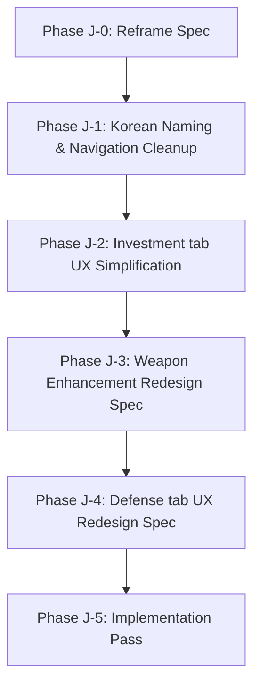

# 🌌 자본전선: 데드라인 (Capital Front: Deadline) - Product Reset & UX Reframe Spec

This document outlines the strategic pivot to realign **자본전선: 데드라인 (Capital Front: Deadline)** from a complex, developer-jargon-heavy structure back to an intuitive, high-engagement, player-first dark frontier defense experience. 

Through this Product Reset, we resolve player confusion by reframing the core systems around four classic, highly readable dark apocalyptic military gameplay pillars: **프론티어 마스터** (Frontier), **히어로즈 페이트** (Fate), **스미스 앤 셔드** (Forge), and **전선 지휘부** (Command).

---

## 🔍 1. Current Problem Summary (UX Mismatch)

During recent playtests, the core gameplay loop was found to be confusing and abstract for first-time players. The mismatch stems from several critical areas:

1. **Terminology Leakage**: High-level developer concepts and generic titles were exposed to the player. For example, "Idle Landlord" / "아이들 랜드로드" lacked thematic flavor, and "RPG" felt overly systemic rather than action-oriented.
2. **Abstract Betting (Investment/Hero's Fate)**: The former Investment tab was overcomplicated with dry financial contracts, making it hard for players to quickly understand what is being risked and what is being predicted.
3. **Underdeveloped Enhancement**: The former Enhancement tab lacked the classic thrill of weapon-upgrading games. A flat 1-10 level loop with a 30% success floor did not deliver the tension of scaling item levels, weapon breakage, or materials recovery.
4. **RPG Dashboard Complexity**: The former "RPG" tab lacked a primary gameplay hook. Standard auto-grinding screens presented raw stat panels (PEN, ACC, SPD) and Reaper warnings rather than answering the player's immediate question: *"How do I play and defend?"*

---

## 🗺️ 2. Product Pillar Reframe (Player-Facing)

The game modules are redefined into four clear, player-facing pillars, prioritizing immediacy and narrative flavor around the core fantasy: *Human territory has been seized by monsters in an apocalyptic war. The player is a supreme commander controlling war capital from the rear, providing fire support, reclaiming zones, collecting taxes, betting on heroes, forging weapons, and commanding defense units.*

```
┌─────────────────────────────────────────────────────────────────────────┐
│                          GLOBAL WALLET HEADER                           │
│     War Cash (전쟁 자금)  │  Capital (작전 자본)  │  Dividends (전투 배당금)      │
└────────────────────────────────────┬────────────────────────────────────┘
                                     │
         ┌───────────────────────────┼───────────────────────────┐
         ▼                           ▼                           ▼
┌───────────────────┐       ┌───────────────────┐       ┌───────────────────┐
│  프론티어 마스터  │       │  히어로즈 페이트  │       │  스미스 앤 셔드   │
│ (Frontier Master) │       │   (Hero's Fate)   │       │  (Smith & Shards) │
└────────┬──────────┘       └────────┬──────────┘       └────────┬──────────┘
         │                           │                           │
         │                           ▼                           │
         └──────────────────►  [ 전선 지휘부 ]  ◄────────────────┘
                             (Frontline Command)
```

### 🏢 A. 프론티어 마스터 (Frontier Master / Short: 프론티어)
*   **Player Concept**: Fire support, reclaim occupied zones, collect war taxes.
*   **Gameplay Actions**: Clicker taps (격전지 개입), purchasing/upgrading 10 tiers of resource bases (수복 구역 / 자원 기지), and activating Rebirths (작전 재기동) for permanent command authority (통치 권위).
*   **Economic Role**: Produces baseline `cash` which acts as a broad horizontal booster for all other modules.

### 📈 B. 히어로즈 페이트 (Hero's Fate / Short: 페이트)
*   **Player Concept**: Speculate on market volatility and hero survival outcomes in high-stakes defense contracts.
*   **Gameplay Actions**: Bid `investment.capital` on volatile frontlines or execute High-Stakes Defense Contracts.
*   **UX Alignment**: Reframe contracts around immediate survival prediction wording:
    *   **영웅 생존** (Hero Survival) vs. **영웅 전멸** (Squad Wipeout)
    *   **방어 성공** (Defense Success) vs. **방어 실패** (Defense Failure)
    *   **결전의 사선 / 배팅 슬립 / 결과 정산** (Bet Slip / Settlement / Confirmation)
*   **Core Feel**: Highly readable prediction cards, eliminating dry contract terminology.

### ⚔️ C. 스미스 앤 셔드 (Smith & Shards / Short: 대장간)
*   **Player Concept**: Strike the anvil, forge weapons, and climb the weapon enhancement ladder.
*   **Gameplay Actions**: Spend `dividends` to enhance weapons across a 1~30강 level progression.
*   **Enhancement Ladder Tiers**:
    *   **1강 ~ 9강**: Common Weapons (*e.g., 평범한 칼*) — High success chance, no risk of breakage.
    *   **10강 ~ 19강**: Mid-Tier Rare Weapons — Medium success chance. Failure may drop level by 1.
    *   **20강 ~ 29강**: Epic Tier Weapons — Low success chance. Failure may maintain, drop, or **break** the weapon.
    *   **30강**: Excalibur (*엑스칼리버*) — Absolute endgame fantasy weapon.
*   **Break & Material System**:
    *   Broken weapons produce **Enhancement Materials/Fragments** (e.g., *강화 파편, 강화석*).
    *   High-level enhancements (20강+) require these materials or secondary lower-level enhanced weapons to succeed.
    *   Full inventory management: weapons can be stored in the inventory, sold on the black market (암시장 판매) for dividends, or sacrificed as enhancement material.

### 🛡️ D. 전선 지휘부 (Frontline Command / Short: 지휘부)
*   **Player Concept**: Automate defensive lines, summon units using combat dividends, and wipe out invading waves.
*   **Gameplay Actions**: 
    *   **Summon**: Draw units using combat dividends (배당금 소환).
    *   **Place/Arrange**: Set up defensive formations.
    *   **Merge/Evolve**: Combine identical units or equip enhanced weapons to scale their stats.
    *   **Defend**: Wipe out invading waves (웨이브 디펜스).
*   **RPG Mapping**: The existing Idle RPG stat upgrades (ATK, SPD, PEN, ACC, CRT) and custom Reaper/Infinite Mode scaling operate as mathematical engines in the background, serving as late-game Defense challenges (무한 전선) rather than first-screen clutter.

---

## 📋 3. Naming & Translation Audit Plan

To complete Phase J-1, the following terminology pivot has been applied across both UI rendering components and translation sheets (`TRANSLATIONS` and `UI_TEXT` objects):

| System / Developer Term | Former Label | Proposed Player-Facing Label | Target Tab / Panel | Status |
| :--- | :--- | :--- | :--- | :--- |
| **Idle Landlord** | 아이들 랜드로드 | **자본전선: 데드라인** | Main Title / App Header | **Complete** |
| **Landlord Tab** | 랜드로드 | **프론티어** | Navigation GNB | **Complete** |
| **RPG Tab** | RPG | **지휘부** | Navigation GNB | **Complete** |
| **Idle RPG** | 방치형 RPG | **자동 디펜스** | Defense Tab Main Header | **Complete** |
| **Stage** | 스테이지 | **웨이브** | Defense Combat Panel | **Complete** |
| **Monster** | 몬스터 | **적** (or 침략자) | Defense Combat Panel | **Complete** |
| **Squad / Unit** | 캐릭터 / 부대 | **방어 편성 / 용병** | Defense Combat Panel | **Complete** |
| **Defense Contract** | 영웅의 운명 배팅 / 계약 | **생존 예측 / 방어 계약** | Investment Prediction | **Complete** |
| **Hero's Fate** | 히어로즈 페이트 | **히어로즈 페이트 (생존 예측)** | Investment Prediction | **Complete** |
| **Settlement** | 정산 | **결과 정산** (or 예측 정산) | Investment Prediction | **Complete** |
| **Game Over / Run Collapse** | 작전 실패 / 부대 괴멸 | **방어 실패 / 전멸** | Failure Overlay Screen | **Complete** |
| **Enhancement Tab** | 강화 | **대장간** | Navigation GNB | **Complete** |

---

## 🚀 4. UI Rework Roadmap (Phase J)

We execute the Product UX Reset in a step-by-step, reviewable sequence to prevent regressions.



### 📍 Phase J-1: Korean Naming & Navigation Cleanup
*   **Scope**: Replace player-facing Korean text in `TRANSLATIONS` and `UI_TEXT` structures.
*   **Deliverable**: Korean tab headers, warning screens, and main titles are fully localized around the "프론티어 마스터 / 히어로즈 페이트 / 스미스 앤 셔드 / 전선 지휘부" labels.
*   **Status**: **Complete**

### 📍 Phase J-2: Investment Tab UX Simplification
*   **Scope**: Simplify the bidding/contracts cards. 
*   **Deliverable**: Replace dry contract layouts with visual "Survival Prediction Cards." Add immediate, highly readable status displays showing predicted survival odds, potential payouts, and the warning that failure triggers **게임오버 (Game Over / Restart)**.

### 📍 Phase J-3: Weapon Enhancement Redesign Spec
*   **Scope**: Draft a comprehensive mechanical spec for the 1~30강 upgrade loop.
*   **Deliverable**: Detail success rate curves, breakage multipliers, material generation math upon weapon destruction, and UI designs for inventory slots, selling, and merging.

### 📍 Phase J-4: Defense Tab UX Redesign Spec
*   **Scope**: Draft the spec to reframe the RPG tab into a Random Tower Defense layout.
*   **Deliverable**: Map current unit lists and stat upgrades directly to interactive "Summon / Place / Upgrade / Defend" card arrays. Map Reaper and Infinite Mode mechanics to elite end-game Defense challenges.

### 📍 Phase J-5: Incremental Implementation Pass
*   **Scope**: Implement the specs generated in J-3 and J-4 one module at a time.
*   **Guardrail**: Ensure each merge maintains stable combat mathematics and completely preserves existing user saves.

---

## 🔒 5. Current System Preservation Rules

To guarantee technical safety, the following core modules remain entirely preserved under the hood:

1.  **Global Wallet & LocalStorage Integrity**: The unified save key `moneyGameUniverseStateV1` must be strictly maintained. Absolutely no structural changes to the persisted state are allowed during naming refactors.
2.  **Investment Combat Settlement Math**: The power-curve odds generation (`(1 - vol^0.6 * 3.5) * 100`) and deterministic success probabilities remain active. Reframing the UI to "Survival Prediction" is purely cosmetic.
3.  **RPG/Defense Engine Formulas**: HP compounding ($100 \times 1.3^{s-1}$ and Infinite stage compounding $1.1^{\text{infStage}}$) must remain untouched. 
4.  **Reaper Pressure Systems**: The Reaper's intensity tiers, modifiers, and Stage 150 Iron Sentinel gating logic remain active, serving as the mathematical backbone for high-wave Defense challenges.
5.  **Static SEO Integrity**: All static deployment support files (`ads.txt`, `robots.txt`, `sitemap.xml`) must remain fully active and in place.

---

## 🚦 6. Implementation Guardrails (For Future Phases)

*   **No Broad Rewrites**: We will NOT rewrite the 7500-line single-file engine in one sweep.
*   **UI wrappers first**: Whenever possible, bridge internal developer naming conventions to player-facing strings using local translation lookups or computed properties.
*   **Small reviewable steps**: Each phase (J-1 through J-5) must be submitted individually, fully validated, and regression-tested before moving to the next.
