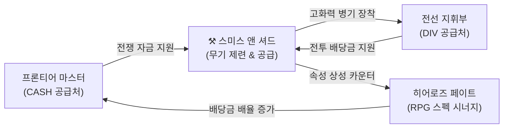

# ⚒️ Smith & Shards: Weapon Fantasy & Dopamine Loop Spec

This document details the core design psychology, player-facing fantasy, and behavioral loops of the **전쟁 대장간 (Smith & Shards)** module for *자본전선: 데드라인 (Capital Front: Deadline)*. It maps out why the loop feels addictive, emotional, and progression-driven before implementing the actual backend systems.

---

## 🛡️ 1. Weapon Identity & Progression Escalation (+1 to +30)

Rather than rendering weapons as mere numbers on a spreadsheet, the progression must represent a gritty narrative transformation. As a commander beats steel on the anvil, a simple tool of war escalates into an apocalyptic, frontline-defining weapon.

### 📈 Progression Tiers & Narrative Prestige
Each upgrade tier represents a massive leap in mechanical weight and aesthetic authority:

| Enhancement Level | Title | Core Narrative Fantasy & Player Emotion |
| :--- | :--- | :--- |
| **+1 ~ +4** | **훈련병의 무딘 칼날 (Recruit's Dull Blade)** | *“This is basic metal. It is standard-issue trash, but it is mine.”* The raw starting point. |
| **+5 ~ +9** | **야전 사령부 군도 (Military Saber)** | *“A reliable weapon for seasoned frontline fighters.”* Standard squad weaponry. |
| **+10 ~ +14** | **전선 처형자 (Frontline Executioner)** | *“This blade has drawn blood under siege.”* Strong visual weight, distinct from standard supplies. |
| **+15 ~ +19** | **선혈의 제련검 (Blood-Forged Weapon)** | *“Anvil strikes have tempered this steel in fire and agony.”* High-tier prestige weapon. |
| **+20 ~ +24** | **사령부 전설 무구 (Legendary Relic)** | *“A heroic artifact capable of halting entire waves of invaders.”* Extreme tension in upgrades. |
| **+25 ~ +29** | **종말급 결전병기 (Apocalypse-Grade)** | *“A weapon designed to shatter armor and pierce fortresses.”* Absolute prestige on the front. |
| **+30** | **신화적 엑스칼리버 (Mythic Sovereign)** | *“The peak of wartime engineering. A singular piece of sovereign steel.”* Mythical status. |

---

## 📈 2. The Dopamine Curve & "One More Strike" Psychology

The core drive of the forge is built on **Intermittent Reinforcement** and **Risk Escalation**. A perfect loop balances anticipation spikes against emotional recovery loops.

```mermaid
flowchart TD
    A["전선 보급 호출 (DIV)"] -->|무기 획득| B["무기 보관고 보관"]
    B -->|CASH 소모| C["⚒️ 모루 타격 시도"]
    C -->|성공 (Dopamine Spike)| D["Enhancement Level +1"]
    D -->|전투 기여도 급상승| B
    C -->|실패 (Emotional Impact)| E{제련 실패 결과}
    E -->|보존| F["유지 (Relief / Retest)"]
    E -->|하락| G["수치 감소 (Sunk Cost Trigger)"]
    E -->|파괴 (Shatter)| H["파편 분해 (Shard Recovery)"]
    F --> B
    G -->|분노의 모루 타격| C
    H -->|파편 교환/제조| I["확률 보정제 / 고급 장비 제조"]
    I --> B
```

### ⚡ Dopamine Triggers
1. **The Anticipation Spike**: The rhythmic beating sound of the anvil (`⚒️ 모루 타격`). The 1-2 second delay before the result screen builds intense, localized tension.
2. **Sunk Cost Pressure**: Once a weapon reaches +10 or +15, the player has invested significant CASH. This investment creates a psychological anchor, making them highly reluctant to abandon the weapon, driving them to take greater risks.
3. **Preservation Psychology**: Safe zones (e.g., no breakage up to +10) build a base layer of comfort, encouraging high-volume active clicking to amass early upgrades before entering the "high-threat" zone.

---

## 💔 3. Failure Psychology & Shard Conservation Loops

Upgrades must carry high stakes, but failure should never feel completely hopeless. We implement a **circular conservation model** so that weapon destruction acts as a gateway to secondary progression.

> [!IMPORTANT]
> **"It must hurt, but it must not break the player."**
> The loss of a high-enhancement weapon should be a major narrative moment, immediately cushioned by a generous resource yield.

### ♻️ Circular Shard Conservation
1. **Weapon Shattering (파괴)**: When a +15 or higher weapon breaks, it shatters into **제련 파편 (Refined Shards)**.
2. **Generous Shard Scaling**: The quantity of shards received scales exponentially based on the enhancement level at the time of destruction.
3. **Recovery Loops**:
   - **확률 보정제 (Success Stabilization Materials)**: Shards can be used to forge stabilizers that add a static $+1\%$ to $+5\%$ success chance to future anvil strikes.
   - **고급 상자 교환 (Prestige supply box)**: Shards can be traded on the Black Market for guaranteed Rare/Epic base weapon frames.
4. **Emotional Pivot**: Instead of rage-quitting, the player thinks: *"My +18 saber broke, but these shards just bought me an Epic tier sword frame and two stabilizers. I am actually closer to a +20 weapon now."*

---

## 💎 4. Low-Tier Weapon Relevance (Circular Loops)

To prevent the player from instantly trashing low-tier weapons as "clutter," every item must retain intrinsic value through strategic utility:

- **제련 제물 (Refining Sacrifices)**: Low-tier items can be consumed to slightly buff the success chance of a higher-tier weapon's upgrade (e.g., sacrificing three +5 sabers to increase a +15 executioner's upgrade odds by 3%).
- **파편 일괄 분해 (Bulk Dismantling)**: Unenhanced items can be broken down for tiny amounts of shards, ensuring that even standard supply drops contribute to the long-term crafting cycle.
- **암시장 현금 전환 (Black Market Liquidation)**: Standard weapons can be liquidated for quick CASH, creating a direct conversion pipeline to fund active anvil strikes.

---

## 🛡️ 5. Inventory Attachment & Emotional Prestige

We want players to feel proud of their arsenal. Attachment is established through:
1. **Equipped Bonding**: When a weapon is equipped to a mercenary (e.g., *Reaper Archetype Counter unit*), its DPS contribution is highlighted in neon green, creating a visual bond between the soldier and their steel.
2. **The Survivorship Bias**: A weapon that survives a $30\%$ upgrade attempt to reach +20 becomes a legend in the player's mind. They will lock it, favorite it, and boast about it.
3. **Historical Refinement Records**: The UI shows the `"최근 모루 타격 결과"` (Recent Anvil Results), celebrating successful runs and logging heroic weapon breaks.

---

## 🌐 6. War Economy Integration (Cross-Tab Synergy)

Smith & Shards is not a isolated spreadsheet mini-game; it acts as the **strategic engine** powering all other modules:



- **Frontier Master (Idle Landlord)**: Generates the massive cash flows (`CASH`) required to fund high-level anvil strikes.
- **Hero's Fate (Betting / History)**: Combat units equipped with powerful forged weapons drive up survival rates in prediction contracts, directly affecting settlement payouts.
- **Frontline Command (RPG / Reaper)**: Weapons equipped to characters directly scale the global DPS required to break infinite mode waves and counter adapting Reaper entities.

---

## 🚫 7. Core Guardrails & anti-Power-Creep Constraints

To maintain game design integrity, future implementation agents must strictly respect these design guardrails:

> [!WARNING]
> 1. **No Spreadsheet Syndrome**: Keep the UI visual, physical, and gritty. Use hammer animations, sparks, and vibrant status cards. Avoid dry, numeric spreadsheets.
> 2. **Strict Safe upgrading Bounds**: Upgrades from +1 to +10 must remain safe (no destruction) to allow casual loops. Risk of destruction must strictly emerge at +11 and scale gradually.
> 3. **No Meaningless Stat Inflation**: Damage power must scale exponentially but match monster HP curves in Frontline Command to avoid instantly trivializing the Infinite Wave thresholds.
> 4. **No Hidden Odds**: Success chances must be printed clearly (e.g., `제련 확률: 90%`) to keep the risk loop transparent and emotionally fair.

---

## 📊 8. Status & Next Roadmap Actions

This spec represents **Phase J-3C-2: Smith & Shards Weapon Fantasy and Dopamine Loop Audit**. It forms the psychological blueprint that downstream implementation tasks (J-3D, J-3E, J-3F, J-3G) will materialize.
