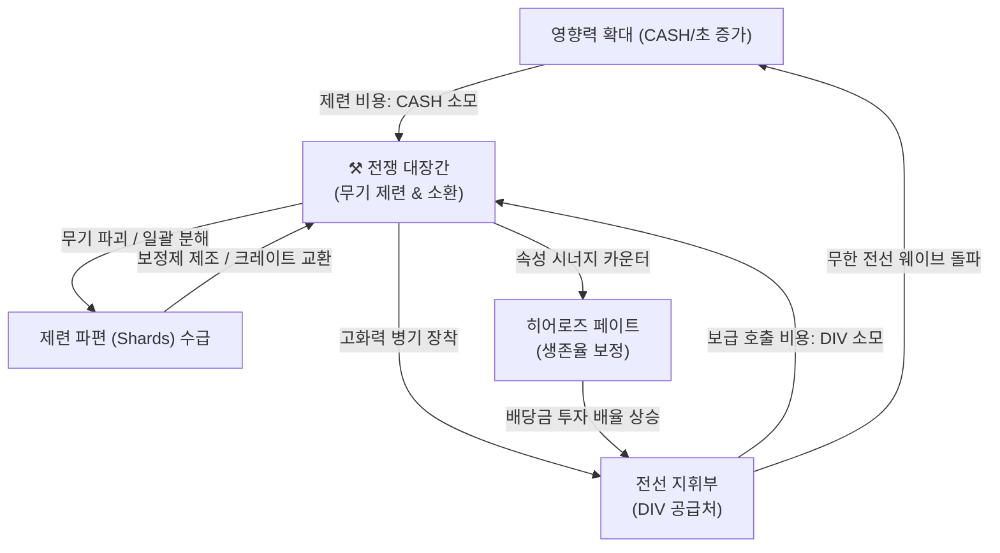

# ⚒️ Smith & Shards: Closed Wartime Economy Matrix Spec

This document outlines the interconnected data and progression mechanics for the **전쟁 대장간 (Smith & Shards)** module in *자본전선: 데드라인 (Capital Front: Deadline)*. It models the progression ladder, resource loops, destruction penalties, shard classification tiers, and Black Market parameters to establish a robust, balanced closed-loop wartime economy before backend implementation begins.

---

## 📈 1. The Enhancement Ladder Matrix (+1 ~ +30)

Upgrading weapons translates numeric power into distinct narrative, emotional, and social brackets. The ladder is balanced across six progression tiers:

| Upgrade Level | Zone & Title | Rarity Tier | Target Success Rate | Target Breakage Rate (on Fail) | Intended Player Emotion & Social Prestige |
| :--- | :--- | :--- | :--- | :--- | :--- |
| **+1 ~ +5** | **초반 보급 구역 (Onboarding)** | Common (일반) | **100% ~ 90%** | **0%** *(Safe Zone)* | *“This is my standard issue equipment. Safe and routine.”* |
| **+6 ~ +10** | **중반 전선 기지 (Stable Progression)** | Uncommon (고급) | **85% ~ 65%** | **0%** *(Downgrade Only)* | *“Feeling established. No fear of breakage, but minor setbacks occur.”* |
| **+11 ~ +15** | **전투 위험 진입 (Danger Entry)** | Rare (희귀) | **60% ~ 45%** | **1% ~ 5%** *(Breakage)* | *“The anvil starts to feel hot. Upgrades require focus and nerves.”* |
| **+16 ~ +20** | **정예 부대 규격 (Prestige Pressure)** | Epic (영웅) | **40% ~ 25%** | **6% ~ 10%** | *“An elite tier weapon. Losing it will hurt, but success means raw power.”* |
| **+21 ~ +25** | **신화적 무장 (Mythic Escalation)** | Legendary (전설) | **20% ~ 10%** | **12% ~ 15%** | *“A state asset. Highly revered by commanders; upgraded with maximum fear.”* |
| **+26 ~ +30** | **군주적 결전령 (Sovereign Territory)** | Mythic (신화) | **5% ~ 3%** | **15% ~ 20%** | *“Mythical, sovereign steel. Achieving +30 represents legendary status.”* |

---

## 🌐 2. The Closed Wartime Economy Loop

The War Forge does not operate in isolation. It forms a closed, self-sustaining loop powered by and driving the surrounding modules:

### 🔁 Interconnected Flow Vectors
1. **Frontier Master (CASH Output) $\rightarrow$ Forge (CASH Input)**: High-level anvil strikes require heavy CASH funding. Frontier real estate income directly fuels the forge's cash appetite.
2. **Frontline Command (DIV Output) $\rightarrow$ Forge (DIV Input)**: Active combat yields戦闘配当 (DIV), which is consumed to trigger Frontline Supply Calls to draw new mercs and weapons.
3. **Forge (Weapons Output) $\rightarrow$ Frontline Command (Combat Input)**: Forged weapons directly scale the global DPS required to breakthrough infinite waves.
4. **Forge (Synergies Output) $\rightarrow$ Hero's Fate (Prediction Input)**: Weapons match character preferences, lowering survival prediction risks in Hero's Fate contracts and securing higher bet yields.

---

## 💔 3. Destruction & Salvage Matrix

When upgrading high-tier weapons, the threat of destruction drives emotional engagement. However, the system turns loss into progression value through the **Circular Salvage** pipeline:

### ♻️ Breakdown & Recovery Parameters
- **Green & Amber Zones (+1 ~ +10)**: No breakage. Failures in $+6 \sim +10$ carry a $25\%$ chance of a $-1$ downgrade, creating standard economic friction.
- **Danger Zones (+11 ~ +20)**: Failure carries a scaling risk of complete weapon shattering.
- **Catastrophic Failure Recovery**: Breaking a weapon grants **제련 파편 (Refined Shards)** scaling exponentially with the weapon’s level at the time of destruction:

$$\text{Shard Yield} = \text{Base Rarity Shards} \times 1.5^{(\text{Enhancement Level} - 10)}$$

- **Psychological Cushion**: A shattered $+18$ Epic weapon yields enough shards to immediately craft 2 Success Stabilizers or purchase 1 High-Tier base weapon box on the Black Market, guaranteeing that the player returns to the anvil stronger.

---

## 💎 4. Shard Classification Matrix

Shards are categorized into four tiers, matching the progression gates:

| Shard Type | Icon & Korean Label | Acquisition Source | Strategic Role & Intent |
| :--- | :--- | :--- | :--- |
| **Basic Shard** | 🪨 **기본 대장간 파편** | Dismantling $+1 \sim +10$ weapons | Used to purchase standard weapon supply boxes. |
| **Refined Shard** | 💎 **정교한 제련 파편** | Shattering $+11 \sim +20$ weapons | Used to craft **제련 보정제 (Success Stabilizers)** adding static $+1\%$ to $+3\%$ success odds. |
| **Mythic Shard** | 🌟 **사령부 신화 파편** | Shattering $+21 \sim +25$ weapons | Used to buy Legendary Epic weapon frames or high-level protection shields. |
| **Sovereign Fragment**| 👑 **군주적 파편 결정** | Shattering $+26 \sim +30$ weapons | Ultimate prestige currency. Used to unlock Mythic custom prefixes. |

---

## 🏪 5. Black Market Economy Matrix

The Black Market is a desperate, opportunistic wartime outpost where salvage is traded:

- **Weapon Liquidation**: Players sell duplicate or unused weapons for quick **CASH** to fund active anvil strikes, turning "junk drops" into immediate progression fuel.
- **Supply Crates**: High-end crates are purchased using Shards, guaranteeing Epic or Rare base frames to kickstart a new upgrade ladder.
- **Stabilizer Manufacturing**: Refined Shards are forged with CASH to create stabilizers, allowing players to strategically bypass bad luck streaks at high level thresholds.

---

## 🎒 6. Inventory Pressure & Attachment Matrix

Inventory management introduces interesting, long-term player dilemmas:

- **Scarcity Pressure**: Base inventory starts at **50 slots**. Unlocking additional slots requires scaling Diamond investments.
- **The Duplicate Recycler**: duplicate weapons can be either:
  1. Sold for cash on the Black Market.
  2. Sacrificed to add $+1\%$ to $+5\%$ upgrade success chances to another weapon.
  3. Broken down for Basic Shards.
- **Aesthetic Locks**: The UI includes favorite and locking features, protecting high-prestige weapons from accidental liquidation or sacrifice.

---

## 🌐 7. Infinite Mode & Reaper Integration

Weapons scale to meet the adapting threats of Frontline Command:
- **Combat Formula Integration**: Weapons equipped to active squad characters directly increase global ATK, SPD, and PEN stats. Matching a character’s `preferredWeaponType` grants a multiplier to the weapon's base stats.
- **Reaper Adaptive Safeguards**: Weapon progression does not trivialize combat. HP scaling for Infinite Mode bosses escalates exponentially. For example:

$$\text{Boss HP} = \text{Base HP} \times 1.25^{\text{Stage Level}}$$

Highly upgraded weapons are mandatory to break high-tier wave thresholds, but they do not allow infinite safe pushing without active character training.

---

## ⚖️ 8. Whale vs. Grinder Balance Protocol

To guarantee long-term economic fairness:
- **Grinder Progressions**: Grinders gather shards and base weapons steadily through daily combat waves and active salvage. They can eventually brute-force high upgrades by utilizing accumulated success stabilizers.
- **Spender Accelerations**: Whales can purchase Diamond boosters to unlock slots, buy extra supply draws, and speed up resource gathering.
- **The Anvil Equalizer**: **Spenders are subject to the exact same upgrade success percentages as grinders.** Diamonds cannot buy a guaranteed +30 weapon directly, ensuring that a mythic sovereign item remains a pure badge of prestige and luck.

---

## 🚫 9. Core Implementation Guardrails

Future implementation tasks must strictly respect these economic guardrails:
1. **Pristine State Schemas**: The upcoming shard currencies and Black Market items must reside inside `gameState.enhancement.shards` and `gameState.enhancement.inventory` to prevent save corruption.
2. **No Pure Spreadsheet UI**: Scrap, salvage, and trade screens must remain thematic and visual, using clear status boxes and industrial icons.
3. **No Premium Auto-Success Tickets**: Premium items must never grant guaranteed high-tier success, preserving the value of hard-earned progression.

---

## 📊 10. Status & Next Roadmap Actions

This spec represents **Phase J-3D: Smith & Shards Weapon Economy Matrix Specification**. It successfully details the Closed Wartime Economy before actual backend database migration schemas (Phase J-3F) and prototyping (Phase J-3G) begin.
