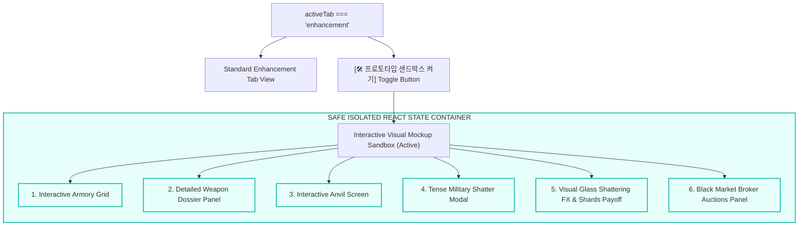

# 🎨 Smith & Shards: Interactive Weapon Screen Mockup Spec

This master specification details the architecture, visual tokens, and localized React state behaviors for the **Interactive Weapon Screen Sandbox Mockup (전쟁 대장간 프로토타입 샌드박스)** in *자본전선: 데드라인 (Capital Front: Deadline)*. It serves as a visual guide and a safe, isolated interactive prototype.

---

## 🛡️ 1. Sandbox Mockup Architecture

To validate first-time player onboarding, visual clutter limits, and mobile touch reachability without risking save data or combat formulas, we deploy a **self-contained Interactive Visual Sandbox** directly inside the active `enhancement` view.

---

## 🎒 2. Component Design & Interactivity States

### 📦 A. Interactive Armory Grid (Inventory Mockup)
- **Visual Design**: Weathered military slots displaying square weapon frames:
  - `Epic Saber +14` (Equipped [E], Locked [🔒]).
  - `Legendary Sword +20` (Pulsing orange HSL border, High Volatility [⚠️] warning flag).
  - `Mythic Sovereign +29` (Radiant pulsing crimson border, legendary epithet overlay).
- **Interactive State**: Clicking a weapon selects it, dynamically injecting its historical records into the Detailed Dossier Panel.

### 📇 B. Detailed Weapon Dossier Panel
- **Visual Design**: Weathered titanium military folder container displaying detailed combat logs:
  - *“Tempered in Sector-B4 Bunker Forge”*
  - *“Survived 14 anvil strikes (3 catastrophic Amber setbacks)”*
  - *“Frontline operations: 140 cleared waves”*
  - *“Encountered Reaper Entity 'Adaptive Oblivion' (Stage 100)”*
- **Interactive State**: Toggle Favorite lock switch dynamically switches the `[🔒]` icon in the inventory frame.

### ⚒️ C. Anvil Enhancement Screen
- **Visual Design**: Industrial caution stripes and heavy metal background with distinct risk readouts:
  - `⚙️ 제련 성공 확률: 45%`
  - `⚠️ 장비 파괴 확률: 5%`
- **Interactive State**: Clicking **`⚒️ 모루 타격 (Strike)`** initiates a 1.5-second clanging simulation:
  - Button switches to active loading grey.
  - local status text blinks: `“모루 타격 중... Clang! Clang!”`
  - Localized panel vibration triggers.
  - On complete, pops open the **Tense Destruction Warning Modal** (if Danger Zone selected).

### 🚨 D. Tense Military Shatter Modal
- **Visual Design**: A high-impact flashing warning banner styled with bold caution lines:
  - `⚠️ CATASTROPHIC DESTRUCTION HAZARD GATES`
  - `“Your +20 Legendary Sword is entering the Sovereign Zone. Failure carries a 15% shattering risk. This action is permanent.”`
- **Interactive State**: Clicking `[확인 (Proceed)]` triggers the mock failure sequence; clicking `[취소 (Cancel)]` returns to the anvil.

### 💥 E. Visual Glass Shattering FX & Shards Payoff
- **Visual Design**: Triggered on proceeding with a high-risk failure:
  - The Selected Weapon Card turns high-contrast solid red.
  - Spider-web crack layers overlay the card frame.
  - The card breaks into geometric splinters.
  - A flashing popup displays a cyan particle explosion: **`“파편화 완료: +450 제련 파편 회수! (Circular Salvage Complete)”`**

### 🏪 F. Black Market Broker Auctions Panel
- **Visual Design**: Weathered trading board displaying scrap metal valuations and relic broker auctions.
- **Interactive State**: Slide broker scale widget to show CASH return valuations based on the selected weapon's survival streaks.

---

## 📱 3. Mobile-First Layout Verification

The Sandbox UI is engineered with responsive visual layouts:
- **Bottom-Aligned Thumb Interactions**: Strike and trade keys are located in the bottom region of the viewport, enabling perfect one-handed mobile controls.
- **Scrollable inner log widgets**: History dossiers use scroll bounds, keeping static stats easily scannable on short screens.

---

## 🚫 4. Strict Visual Sandbox Guardrails

1. **Strict State Isolation**: All interactive actions (selecting weapons, upgrades, shatters, or broker liquidations) write exclusively to isolated local React state variables inside `index.html`.
2. **Zero Production Mutation**: The sandbox NEVER writes to `gameState.enhancement.inventory` or `gameState.wallet.cash`, leaving all active RPG and combat loops completely unaltered.
