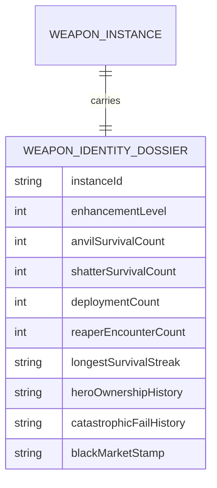
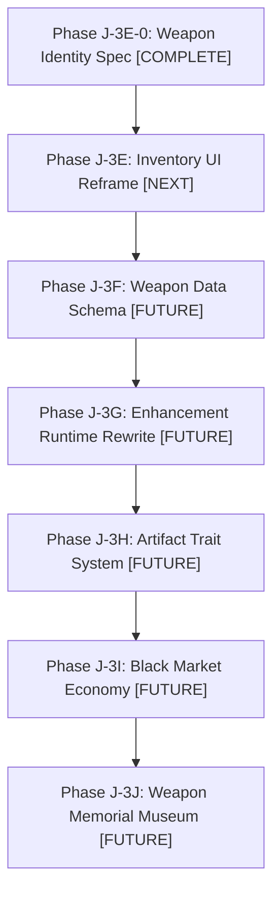

# 🗡️ Weapon Identity & Historical Artifact System Spec

This master specification defines the design philosophy, data memory schemas, conditional damage/blessing layers, and visual UX parameters for the **Weapon Identity Layer** within the **스미스 앤 셔드 (Smith & Shards)** module for *자본전선: 데드라인 (Capital Front: Deadline)*. It serves as the canonical system bible to prevent weapon progression from collapsing into a dry, numbers-only enhancement simulator.

---

## 🛡️ 1. Weapon Identity Philosophy

In most idle and RPG games, weapons are disposable stat sticks. Players hold onto an item until a marginally higher number drops, instantly trashing the old weapon without a second thought. This creates a shallow, transaction-driven player relationship.

In *자본전선: 데드라인*, civilization is collapsing under infinite monster pressure. The player acts as the supreme rearline war-capital commander. Every piece of steel sent to the front represents precious capital, desperate engineering, and soldiers' lives. 

> [!IMPORTANT]
> **"Weapons are battlefield histories, not product inventory items."**
> A weapon that survives repeated near-destruction attempts at the anvil, or is carried through a catastrophic boss encounter in Infinite Mode, must accumulate scars, prestige, and unique narrative weight. Players should not think *“I replaced item #482,”* but rather *“This is the blood-stained saber that killed the Stage 100 Reaper.”*

---

## 💾 2. The Weapon Memory Model (Conceptual Metadata)

To anchor emotional attachment in raw data, each weapon instance accumulates a conceptual history dossier. This history is tracked through a series of metadata layers:



### 📊 Historical Tracking Indicators (Non-Persistent Architecture)
- **Anvil Survival Count (모루 타격 생존 횟수)**: The total number of successful refinement clicks.
- **Shatter Survival Count (파괴 위기 생존 횟수)**: The number of times the weapon survived a $10\% \sim 20\%$ breakage calculation in the Danger Zone.
- **Deployment Count (실전 전선 참전 횟수)**: The number of combat runs this specific weapon instance was equipped to an active frontline squad character.
- **Reaper Encounter Count (리퍼 조우 기록)**: The number of Infinite Mode boss phases this weapon faced, tracking direct encounters with boss adaptation cycles.
- **Heroic Carry Moments (전투 캐리 기록)**: Highlighting instances where this weapon's equipped character delivered over $50\%$ of the team's overall DPS in a cleared Infinite wave.
- **Ownership Lineage (대원 인계 이력)**: A text record showing the names of characters who previously equipped this weapon (e.g., *“Equipped by Sniper-04 $\rightarrow$ Vanguard-02”*).
- **Catastrophe History (대장간 재앙 이력)**: Records showing how close the weapon came to shattering, such as surviving consecutive Amber Zone downgrades.

---

## 🏷️ 3. Weapon Epithets & Dynamic Titles

Weapons earn dynamic prefixes and titles based on their specific historical metadata, rather than random loot tables.

```
[Dynamic Title] + [Base Weapon Name] + [Enhancement Level]
"The Reaper-Touched Scarred Iron Dagger +17"
```

### 🎖️ Dynamic Title Triggers

| Title Category | Example Title | Required Metadata Trigger | Emotional Narrative Role |
| :--- | :--- | :--- | :--- |
| **Refinement Survival** | **흉터가 가득한 (The Scarred)** | Survived 3 Amber Zone downgrades without breaking. | *“This weapon has been beaten into submission on the anvil.”* |
| **Boss Exposure** | **리퍼의 피를 묻힌 (Reaper-Touched)** | Carried through 10 boss adaptation phases. | *“Infused with adapting void energy; highly prestigious.”* |
| **frontline Honor** | **전선의 생존자 (Frontline Survivor)**| Deployed in over 100 cleared wave runs. | *“A veteran blade that has seen endless siege.”* |
| **Failed Shatter** | **잿더미에서 돌아온 (Ashen Blade)** | Survived a $15\%$ shattering roll. | *“A weapon that should have shattered, but survived by pure luck.”* |
| **High Stakes** | **사령관의 긍지 (Commander's Pride)**| Reached +20 using no success stabilizers. | *“A high-stakes gamble that succeeded against all odds.”* |
| **Black Market Sale** | **암시장 밀수품 (Contraband Relic)**| Transferred through 3 separate auctions or liquidations. | *“A dirty, capitalize-driven weapon with an illegal lineage.”* |

---

## 💔 4. Weapon Condition & Dynamic Scar Model

To visualize the weapon's journey, we introduce a conceptual condition model. Physical modifications to the weapon are visible on its dossier:

- **균열 상태 (Crack States)**: Visual cracks spider-webbing across the card border after surviving a near-shatter calculation.
- **과제련 상태 (Overforged States)**: A metallic, glowing burn mark appearing on the weapon blade, signifying high CASH expenditure.
- **오염 상태 (Contaminated States)**: A purplish void haze coating the weapon card, earned after facing the adapts of the Reaper.
- **축복 상태 (Blessed States)**: A golden, rhythmic spark layer, indicating successful application of premium stabilizers.
- **불안정 상태 (Unstable States)**: Rhythmic screen shaking or localized particle flares on the inventory card, warning the commander that the next upgrade failure carries a catastrophic $20\%$ breakage rate.

---

## 💎 5. Weapon Historical Value Model

Even if a weapon’s base DPS is outclassed by a fresh drop, its historical prestige makes it highly valuable to the war economy:

- **Commander's Relic Vault**: A locked cabinet where retired frontline weapons can be placed to grant passive team-wide buffs (e.g., *“A +15 veteran saber retired to the vault grants all recruits $+1\%$ base attack speed”*).
- **Fallen Hero Inheritance**: When a prediction contract in Hero's Fate settles in catastrophic death, the deceased hero’s equipped weapon returns to the player with a permanent inheritance stamp, turning a tragic loss into a prestigious heirloom.
- **Impossible Survival Valuation**: A +12 Common weapon that survived a $5\%$ success rate attempt gains custom collectors' value, making it highly valuable if auctioned on the Black Market.

---

## 🌐 6. Hero & Frontline Integration

Weapons interact dynamically with the active roster:
- **Hero-Bonding**: If a weapon remains equipped to a character for over 50 combat runs, it gains a bonding affinity, scaling preferred weapon synergy bonuses by an extra $+10\%$.
- **Fallen Hero relics**: A fallen hero leaves their equipped weapon as a prestigious heirloom, capturing their name and final combat wave in the item description.
- **Reaper Contamination**: Defeating a high-tier Infinite Boss phase carries a chance of corrupting the equipped weapon, transforming its damage into void armor-piercing damage at the cost of rendering future upgrades highly volatile.

---

## 🏪 7. Black Market & Economic Storytelling

The Black Market is a capitalistic, desperate hub:
- **Relic Auctions**: Commanders can place high-prestige, title-carrying weapons up for bid. Collectors buy them for high CASH premiums based entirely on their historical survival dossier.
- **Contraband Supplies**: Players purchase illegal, unstable weapon modifications that introduce high risk (e.g., $+10\%$ success odds, but failure guaranteed to shatter).
- **Desperate Salvage**: Scrapping named weapons yields massive Refined Shards, but prompts an emotional confirmation popup: *“Are you sure you want to scrap 'The Scarred' saber that cleared Stage 100?”*

---

## 🎨 8. Visual Dossier UX Direction

The weapon card UI should evolve from a generic RPG slot into a gritty **military artifact dossier**:

```
+-----------------------------------------------------------+
| [STAMP: APPROVED FOR ACTIVE FRONT]                         |
|                                                           |
|  ⚔️ THE REAPER-TOUCHED MILITARY SABER +18                 |
|  -------------------------------------------------------  |
|  [||||||||||||||| ] ATK: 45,900  | preferred: SABER       |
|                                                           |
|  [!] CONDITION: UNSTABLE (HIGH VOLATILITY OVER ANVIL)     |
|  -------------------------------------------------------  |
|  HISTORY DOSSIER:                                         |
|  - Forged in Rearline Bunker Forge Sector-B4              |
|  - Survived 14 Anvil Strikes (3 critical shatters)         |
|  - Deployed: 120 combat waves under Commander Ryan         |
|  - Encountered Reaper Entity 'Adaptive Oblivion' (St. 100)|
|                                                           |
|  [LOCK STATE: ACTIVE]          [FAVORITE STATE: ON]       |
+-----------------------------------------------------------+
```
*Visual indicators include military-style stamps, warning stripes, burn marks from failed upgrades, and void haze borders.*

---

## 🧠 9. Player Psychology Model

The system leverages fundamental behavioral loops to build deep long-term attachment:
- **Loss Aversion**: The pain of losing a +15 weapon is intense, but because the player remembers the weapon's journey, the transition into Refined Shards feels like a heroic sacrifice that advances the overall war campaign.
- **Intermittent reinforcement**: Dynamic titles reward the player for taking high-stakes risks, celebrating rare wins and cushioning setbacks.
- **Prestige Ownership**: Players do not boast about raw stat sheets; they brag about the unique narrative titles and conditions their gear accumulated.

---

## 🚫 10. Core Implementation Guardrails

To preserve game design integrity:
1. **Identity Over Raw Stats**: Enhancement must never become a simple battle of inflation. Static base stats are tightly bounded, while historical titles and conditions provide the primary prestige.
2. **Strict Save Isolation**: Dynamic metadata schemas must be conceptualized first, and when implemented (Phase J-3F), must map safely into isolated properties inside `inventory` objects to prevent save corruption.
3. **No spreadsheet saturated UI**: Keep the visuals physical, mechanical, and immersive.

---

## 🗺️ 11. Suggestive Implementation Roadmap



---

## 📊 12. Status & Next Roadmap Actions

This spec represents **Phase J-3E-0: Weapon Identity & Historical Artifact Specification**. The next active phase is **Phase J-3E: Inventory UI Reframe**, which will focus on mock reframing the HTML/Tailwind layout into distinct, high-fidelity weapon cards, locked toggles, and equip slots.
