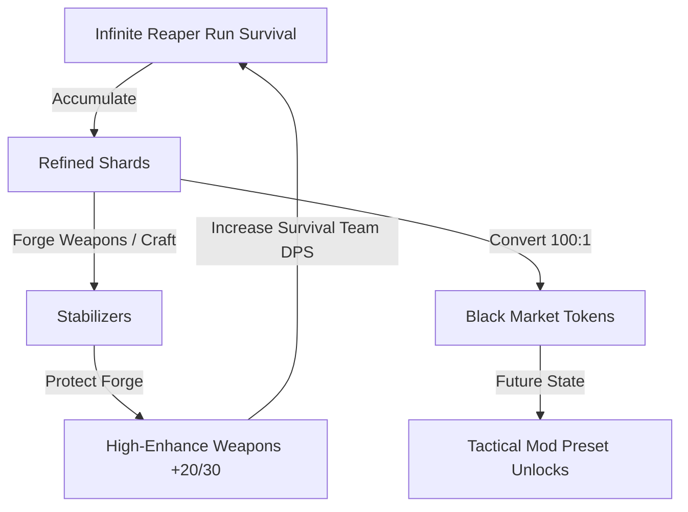

# Analysis & Specification: Reaper Run Objective & Black Market Economy Scaffolding (Phase K-3 & L-1)

## 1. Wave Objective Formula & Stage Boundaries

The wave objective logic resolves dynamically based on the current active stage. This prevents any out-of-sync or stale static UI text. The objective strings mapping to stages are categorized as follows:

| Stage Range | Objective Type | Korean Output | English Output |
| :--- | :--- | :--- | :--- |
| `stage < 101` | Locked/Default | 무한 리퍼 모드에 진입하여 생존하십시오. | Enter Infinite Reaper Mode and survive. |
| `101 <= stage < 150` | Sentinel Approach | Stage 150 Iron Sentinel까지 생존을 유지하십시오. | Survive until the Stage 150 Iron Sentinel Gate. |
| `stage == 150` | Boss Target | 현재 웨이브를 돌파하십시오. 철벽 감시자가 대기 중입니다. | Break through the current wave. Iron Sentinel awaits. |
| `stage > 150` | Extreme Sector | 극한 구간을 돌파하여 다음 임계점을 확인하십시오. | Break through the extreme sector and find the next threshold. |

---

## 2. Milestone Preview State Mapping

To drive engagement and foreshadow deep infinite progression, the milestone tracking system displays the next target threshold. Known milestones are:
1. **Stage 150**: Iron Sentinel Gate (Active combat check)
2. **Stage 200**: Undisclosed Threshold (Preview only)
3. **Stage 300**: Undisclosed Threshold (Preview only)
4. **Stage 500**: Undisclosed Threshold (Preview only)
5. **Stage 1000**: Undisclosed Threshold (Preview only)

When a player exceeds Stage 150, the next milestone target dynamically resolves to the next tier (e.g., Stage 200, 300, etc.). Preview-only milestones display a custom locked/preview styling to indicate content gating.

---

## 3. Economical Feedback Loop Mechanics

The core game loop relies on the synchronization of two distinct economies: the primary RPG/combat economy (Dividends, Cash) and the post-Dorothy endgame forge economy (Refined Shards, Black Market Tokens).



---

## 4. Black Market State Schema Expansion

To scaffold the upcoming Black Market, we expand the existing state schema with two new fields:

1. **`wallet.blackMarketTokens`** (integer, default `0`):
   - Added to default game state wallet.
   - Fully normalized inside `normalizeGameState` to ensure legacy compatibility.
2. **`item.mods`** (array of strings, default `[]`):
   - Appended to weapon blueprints in the static `GACHA_ITEMS` registry and new item generators.
   - Normalized inside `normalizeGachaItem` with array validation, preventing undefined reads.
   - Safe fallbacks (`item.mods ?? []`) enforced at all read sites.

---

## 5. Trait Placeholder UI Mockup

The Weapon Trait Placeholder UI is injected inside the weapon card list on the Smith & Shards tab. It uses a dark tactical theme that stands out yet integrates cleanly into the existing card structure:

```
+---------------------------------------------+
| [E] Sword of Destiny +21       DPS 452.4K   |
| Mythic Weapon                  +105% DPS    |
+---------------------------------------------+
| Cost: 1,500,000 Cash      Chance: 25%       |
| [ Enhance ] [ Use Stabilizer (3) ]   [🔓]   |
+---------------------------------------------+
|  TACTICAL MODIFICATIONS PRESET              |
|  +---------------------------------------+  |
|  | Secure Black Market Tokens to unlock  |  |
|  | modification presets.                 |  |
|  +---------------------------------------+  |
+---------------------------------------------+
```

### Visual Specifications
- **Container**: `bg-zinc-950/60 border border-zinc-900 rounded p-1.5 mt-2`
- **Label**: `text-[9px] font-black text-zinc-500 uppercase tracking-wider`
- **Helper text**: `text-[9px] font-bold text-zinc-400 leading-tight`
- **Theme**: Preserves the pitch-black aesthetic with no layout shifting or overflow under 360px viewport widths.
