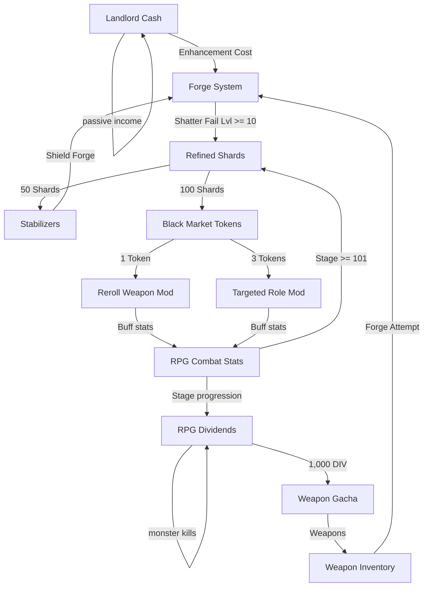

# Phase P-2C: Forge Risk Economy Audit

This audit evaluates the balance, risk profiles, and resource pacing of the Forge and Black Market systems following the Phase P-2B alignment of weapon shatter salvage rewards to the level-and-rarity-scaled helper `getSalvagePayout(currentLevel, item.rarity)`. 

Specifically, this document audits the threat of late-game shard inflation, evaluates the consumption rates of stabilizers, analyzes the mathematical viability of infinite safe-forge loops, and checks whether progression tension remains healthy.

---

## 1. Shard Inflation Audit

The shard economy is centered around the weapon shattering (salvaging) mechanic, which triggers upon failure when forging in danger zones (+10 or higher) without a stabilizer. The payout is determined by:
$$\text{Salvage Payout} = \max\left(5, \lfloor (10 + \text{enhanceLevel} \times 15) \times \text{rarityMultiplier} \rfloor\right)$$

### 1.1 Shard Yield Matrix
Based on this formula, the raw shard payouts at key progression milestones across weapon rarities are calculated as follows:

| Weapon Rarity | Multiplier | Payout at +10 (Base: 160) | Payout at +20 (Base: 310) | Payout at +30 (Base: 460) |
| :--- | :---: | :---: | :---: | :---: |
| **Common** | 1.0x | 160 shards | 310 shards | 460 shards |
| **Uncommon** | 1.2x | 192 shards | 372 shards | 552 shards |
| **Rare** | 1.5x | 240 shards | 465 shards | 690 shards |
| **Epic** | 2.0x | 320 shards | 620 shards | 920 shards |
| **Legendary** | 3.0x | 480 shards | 930 shards | 1,380 shards |
| **Mythic** | 5.0x | 800 shards | 1,550 shards | 2,300 shards |

### 1.2 Stabilizer Recovery Rates After Breakage
Since stabilizers cost **50 shards** each to craft, we can calculate the stabilizer purchasing power of a shattered weapon at different levels:
*   **At +10**:
    *   *Common/Uncommon*: Recover 3.2 to 3.8 stabilizers.
    *   *Rare/Epic*: Recover 4.8 to 6.4 stabilizers.
    *   *Legendary/Mythic*: Recover 9.6 to 16.0 stabilizers.
*   **At +20**:
    *   *Common/Uncommon*: Recover 6.2 to 7.4 stabilizers.
    *   *Rare/Epic*: Recover 9.3 to 12.4 stabilizers.
    *   *Legendary/Mythic*: Recover 18.6 to 31.0 stabilizers.
*   **At +30**:
    *   *Common/Uncommon*: Recover 9.2 to 11.0 stabilizers.
    *   *Rare/Epic*: Recover 13.8 to 18.4 stabilizers.
    *   *Legendary/Mythic*: Recover 27.6 to 46.0 stabilizers.

### 1.3 Estimated Shard Income vs. Stabilizer Burn Rates
Under normal gameplay conditions, a player who wishes to protect their weapon from shattering will always use a stabilizer when forging at level $L \ge 10$.
*   **Success Chance**: At $L \ge 10$, success chance is clamped at $30\%$. With a stabilizer ($+3\%$ success bonus), the chance becomes **$33\%$**.
*   **Failure Chance**: $67\%$. A failure with a stabilizer prevents shattering but causes level degradation (drops by 1 level).
*   **Expected Stabilizer Burn**:
    Let $S_L$ represent the expected number of stabilizers consumed to advance from level $L$ to $L+1$.
    *   For $L = 10$: If the forge fails, the weapon degrades to $+9$ (Safe Zone, no stabilizers required and 0% break chance). Thus, the player can forge back from $+9$ to $+10$ using cash, requiring 0 stabilizers.
        $$S_{10} = 1 + 0.67 \times (0 + S_{10}) \implies S_{10} = \frac{1}{0.33} \approx 3.03\text{ stabilizers}$$
    *   For $L > 10$: A failure drops the weapon to $L-1$, requiring $S_{L-1}$ stabilizers to get back to $L$, and then $S_L$ to try again.
        $$S_L = 1 + 0.67 \times (S_{L-1} + S_L) \implies S_L = \frac{1 + 0.67 S_{L-1}}{0.33} \approx 3.03 + 2.03 S_{L-1}$$
    
    Using this recurrence, the expected stabilizers required per level increase are:
    *   $S_{10} \approx 3.03$
    *   $S_{11} \approx 9.18$
    *   $S_{12} \approx 21.67$
    *   $S_{13} \approx 47.03$
    *   $S_{14} \approx 98.51$
    *   $S_{15} \approx 203.04$
    *   $S_{16} \approx 415.27$
    *   $S_{17} \approx 846.18$
    *   $S_{18} \approx 1,721.22$
    *   $S_{19} \approx 3,500.48$

    *   **Total Expected Stabilizers to reach +20 from +10**:
        $$\sum_{L=10}^{19} S_L \approx 6,865.6\text{ stabilizers } (343,280\text{ shards})$$
    *   **Total Expected Stabilizers to reach +30 from +20**:
        $$\sum_{L=20}^{29} S_L \approx 7,034,064\text{ stabilizers } (351.7\text{ million shards})$$

> [!NOTE]
> The exponential stabilizer consumption ($S_L \approx 2 S_{L-1}$) is caused by the negative drift of the random walk ($p = 0.33 < 0.5$). While $+10$ is easily reachable, $+20$ represents an astronomical shard investment, and $+30$ is virtually inaccessible via passive farming alone.

---

## 2. Stabilizer Economy Audit

### 2.1 Crafting Cost & Pacing
*   **Crafting Cost**: 50 shards per stabilizer.
*   **Combat Shard Income (Infinite Mode, Stage 101+)**:
    $$\text{Shards Gained Per Kill} = \left\lfloor 2 + 0.2 \times \left( \lfloor \frac{\text{Stage} - 100}{10} \rfloor + 1 \right) \right\rfloor$$
    *   *Stage 101–109*: 2 shards/kill (25 kills/stabilizer).
    *   *Stage 150–159*: 3 shards/kill (~17 kills/stabilizer).
    *   *Stage 200–209*: 4 shards/kill (~13 kills/stabilizer).
    *   *Stage 300–309*: 6 shards/kill (~9 kills/stabilizer).
    *   *Stage 500–509*: 10 shards/kill (5 kills/stabilizer).
*   **Cadence**: At a late-game combat cadence of 1 kill every 2 seconds, a player at Stage 150 earns ~90 shards/hour (~1.8 stabilizers/hour). At Stage 300, they earn ~180 shards/hour (~3.6 stabilizers/hour).

### 2.2 Economy Sufficiency
Comparing stabilizer burn rates to income:
*   To forge from $+10$ to $+11$, expected cost is $9.18$ stabilizers (459 shards). At Stage 150, this takes **~5.1 hours** of active grinding.
*   To forge to $+20$, the expected grind represents **thousands of hours** of active combat play.
*   Therefore, stabilizers are highly valuable, and the risk cannot be trivialized by normal active play. Shards are naturally deflated in genuine progression loops.

---

## 3. Forge Tension Audit

To evaluate if danger tension still exists, we model progression survival without stabilizers:

### 3.1 Survival Probability (No-Stabilizer Runs)
If a player attempts to forge weapons without stabilizers:
*   **Safe Zone (+0 to +9)**: 0% breakage chance. Level drops by 1 on failure.
*   **High Risk (+10 to +19)**: 20% breakage chance on failure, 80% degradation chance. Success chance = 30%.
    *   Probability of a weapon reaching $+20$ starting from $+10$ without shattering:
        **$\approx 0.0165\%$** (about 1 in 6,000 attempts).
*   **Extreme Risk (+20 to +29)**: 70% breakage chance on failure, 30% degradation. Success chance = 30%.
    *   Probability of a weapon reaching $+30$ starting from $+20$ without shattering (assuming degradation behaves like a safe zone, which is a massive overestimation):
        **$\approx 0.0012\%$** (about 1 in 85,000 attempts).

> [!IMPORTANT]
> The absolute risk of weapon loss when forging without stabilizers is extremely high. The tension in the Forge remains severe; $+10$ is the start of the danger zone, $+20$ is highly aspirational, and $+30$ is a legendary milestone. The milestone toasts match the actual difficulty curves perfectly.

---

## 4. Economy Interaction Audit

The game features several interconnected economic systems:
1.  **Landlord Cash Inflation**: Properties generate cash passively. In the late game, cash scales exponentially (via high-tier properties and Rebirth multiplier), meaning cash becomes effectively infinite.
2.  **RPG Stage Scaling**: Combat stage increases DPS requirements, pushing the player to upgrade weapons and mods.
3.  **Black Market Token Sinks**: Shards are converted to Tokens ($100:1$ rate). Targeted mods roll cost 3 tokens (300 shards), while normal rolls cost 1 token (100 shards).
4.  **Stabilizer Crafting**: Shards are converted to stabilizers ($50:1$ rate) to protect high-risk forges.

### 4.1 Sink Health & Balance
The Black Market acts as a highly effective sink for shards. Perfecting a weapon's mod through targeted rolls consumes hundreds of tokens (tens of thousands of shards). Because players must divide their shards between crafting stabilizers (for weapon enhancement) and converting to tokens (for weapon modifications), the two systems naturally compete, preventing stockpiling.

---

## 5. Identified Risks

### 5.1 The Infinite Safe-Forge Loop (Shard Printing)
Although active grinding in Infinite Mode is slow, the late-game cash inflation allows a severe economic exploit:
1.  **Weapon Acquisition**: A player draws weapons from the gacha using their abundant dividends, or relies on the starter weapon recovery (which grants a free $+0$ Common weapon when the inventory is empty).
2.  **Safe Enhancement**: Using cash (which is effectively infinite in the late game), the player enhances the weapon from $+0$ to $+10$. Because $+0$ to $+9$ is the Safe Zone, there is **0% chance of shattering**, requiring **0 stabilizers**.
3.  **Forced Shattering**: At $+10$, the player attempts to forge the weapon to $+11$ *without* a stabilizer.
    *   If it fails and degrades back to $+9$, they use cash to upgrade it back to $+10$.
    *   If it succeeds to $+11$, they continue forging without a stabilizer.
    *   Eventually, the weapon *must* fail and shatter (14% chance per attempt starting at $+10$).
4.  **Shard Harvester**: Upon shattering, the weapon awards a level-and-rarity-scaled payout.
    *   A shattered Common $+10$ weapon awards **160 shards** (worth $3.2$ stabilizers or $1.6$ Black Market tokens).
    *   If the player used a Mythic weapon from the gacha, a shattered $+10$ awards **800 shards** (worth $16$ stabilizers or $8$ tokens).
5.  **Trivialization**: Since the only cost to reach $+10$ is cash, the player converts their infinite cash into valuable refined shards and tokens. This bypasses the intended combat-grind pacing and trivializes the risk of the Forge.

---

## 6. Minimal Tuning Suggestions

To preserve Forge danger tension and resolve the safe-forge loop without a massive economy redesign, the following minor calibrations are recommended:

*   **Tuning Suggestion A: Implement a Level-Shatter Gate for Salvage**
    *   *Concept*: Weapons shattered below $+15$ should award significantly fewer shards, or no shards at all.
    *   *Impact*: By only awarding salvage payouts starting at $+15$, players cannot exploit the safe $+0$ to $+10$ range. The player must risk shattering the weapon repeatedly between $+10$ and $+15$ to get a payout, which burns stabilizers or risks losing the weapon early, neutralizing the free-loop profitability.
*   **Tuning Suggestion B: Scale Salvage Rarity Multiplier by Level**
    *   *Concept*: The rarity multiplier should not be a flat value at all levels. Instead, make the rarity multiplier scale dynamically with level (e.g., at $+10$ it is capped at $1.0\text{x}$ or $1.2\text{x}$ for all rarities, and only reaches the full $3.0\text{x}$ or $5.0\text{x}$ at $+20$ or higher).
    *   *Impact*: Prevents players from using low-level Mythic/Legendary gacha pulls as immediate $800$ shard harvesting items.
*   **Tuning Suggestion C: Exponential Cash Scaling in the Safe Zone**
    *   *Concept*: Increase the cash cost of safe-zone enhancements significantly at levels $+8$ and $+9$.
    *   *Impact*: Increases the friction of safe-zone forging, matching late-game cash inflation.

---

## 7. Conclusion

The weapon shatter salvage system successfully ties Forge risk to rewards. However, late-game cash inflation combined with the zero-risk nature of the safe enhancement zone (+0 to +9) creates an exploit where cash can be converted to shards infinitely and safely. Implementing a level-shatter gate or level-scaled rarity multipliers will successfully patch this exploit while preserving the high-stakes, high-tension design of the Forge.
